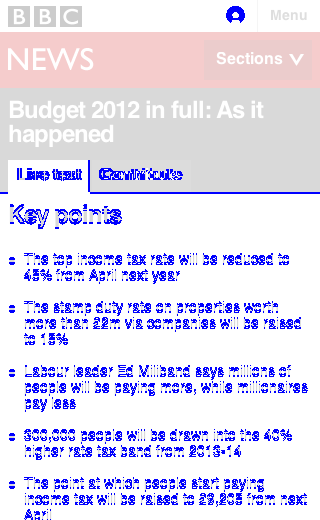
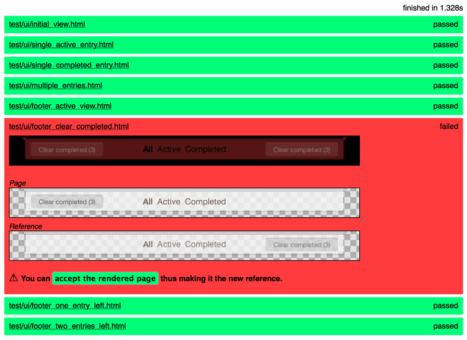
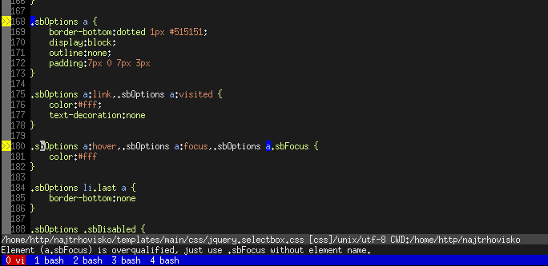
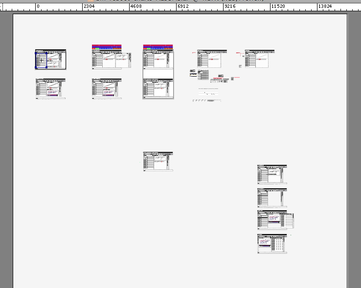
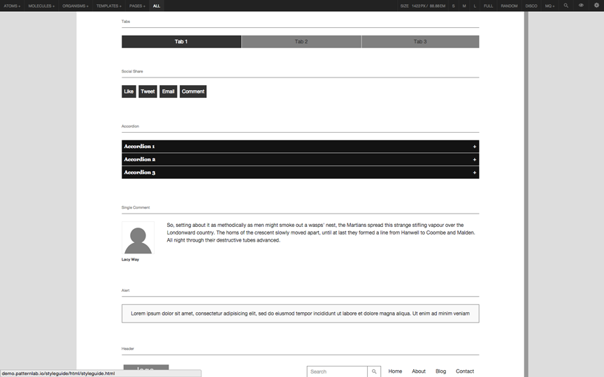
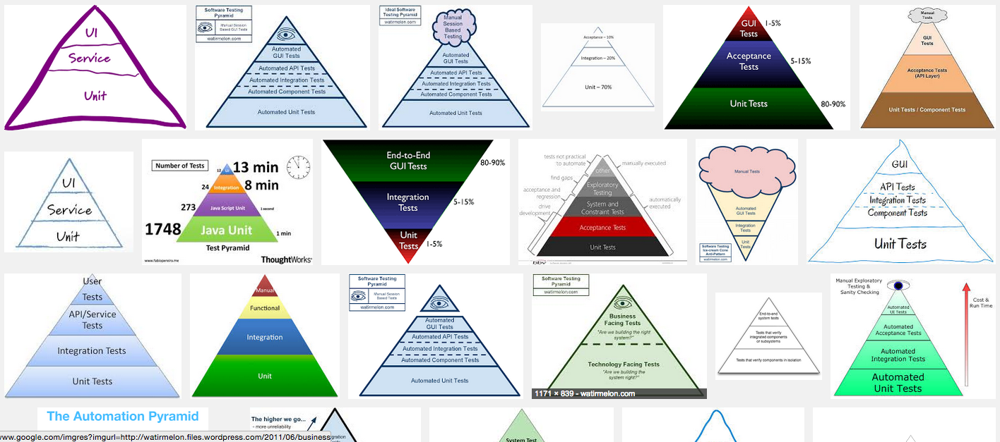

class: center middle

# Hi :-)

---

# Towards a Theory & Methodology of Test-Driven Design

Jonathan Berger, 2015

Mobile Central Europe, Warsaw

---

## Who Am I?

- [@jonathanpberger](http://jonathanpberger.com)
- design, code, pm
- ~30 agile projects since 2008
- interested in agile practice for design

---

## Who are you?
Show of hands:

--

- Designer?
--

- Developer?
--

- What else?
---


## What it says on the tin

> Years ago, Developers had problems and devised Agile techniques to address them. Today, Designers face similar problems. Can we adopt similar techniques? In this talk, we’ll explore what automated testing might look like for design. What would it look like to have a more defined definition of “done” for design? What if designers could refactor with impunity? We’ll explore testing possibilities for Visual design, User Experience design, and front-end engineering, and try to build a testing pyramid for design.

---

## Hypotheses

1. Design practice can learn from Agile Development
2. BUT it's not an exact 1:1 mapping
3. The [Next Biggest Boulder][boulder] in the road: **casting emerging tools in the context of a coherant practice.**

---

<!-- 
# Goal of this Talk
- Share the state of the art for Design Testing
- Suggest the possibilities for TDD for design
- Argue that we need more than tools: we need process

-->

## Agenda
- Agile and Design and Testing
- Theory of TDDesign: Why is it Useful?
- Methodology of TDDesign: How might it be done?
- Next Steps

---

class: center, middle, warning

## WARNING: "Testing" is a messy word.

???

- In the design context, it usually means User Testing
- User Testing is a part of this, but we're talking about a lot more

---

class: center, middle

.f2[Testing vs. Test-Driving vs. User Testing]

---

class: center, middle, inverse
# Agile + Testing + Design

---

class: center, middle
.f2[Once upon a time...]

---

class: center, middle
name: developer-problems

## Developers had problems

---

background-image: url(images/principles.png)

---
class: middle, center

## (Shorter) [Principles Behind the Agile Manifesto](http://www.agilemanifesto.org/principles.html)

---

class: center, middle, warning

.f1[Things Hurt!!]

---

name: hurt
layout: true

### Things that hurt

---

- Changing requirements
- "Seagull" management
- Low-fidelity communication
- Doing unnecessary work
- Infrequent delivery
- Slow-to-evolve process
- Unsustainable pace

???

Through a very scientific process, the list was consolidated

---

- .de-em[Changing requirements, e.g.] **backlog churn**
- .de-em["Seagull" management, e.g]. **swoop in, poop all over, fly away**
- .de-em[Low-fidelity communication, e.g.] **not knowing what to build**
- .de-em[Doing unnecessary work, e.g.] **building the wrong thing**
- .de-em[Infrequent delivery, e.g.] **monthly or quarterly or NEVER releases**
- .de-em[Slow-to-evolve process, e.g.] **broken process**
- .de-em[Unsustainable pace, e.g.] **late nights, weekends**

---
layout: false

layout: true
### The Result

---
- Time is wasted on distractions
- Motivation wanes
- Cost of change is high
- Customers aren't satisfied

---

- .de-em[Time is wasted on distractions, e.g.] **"What are they doing?!"**
- .de-em[Motivation wanes, e.g.] **we're bored and upset**
- .de-em[Cost of change is high, e.g.] **product is unresponsive**
- .de-em[Customers aren't satisfied, e.g.] **FAILURE AND MISERY!!**

---

layout: false

class: center, middle, warning

.f1[

SPOILER ALERT!!

]

???

We've been talking about a 20-year old engineering story, but

---

class: center, middle, inverse

.f1[

Designers have many of the same problems today!!

]

---
class: center, middle
.f2[(back to developers)]

???

the devs' response?

---
name: agile-manifesto
background-image: url(images/agile-manifesto.png)

---

name: agile-in-practice
class: center, middle

.f2[What does "Agile" mean in practice?]

---

## Agile Development in practice

.left-third[
.f3[Continuously]

optimize for...

- **Outside-In** dev't
- low **Cost Of Change**
- tight **feedback loops** with {users, business, product}
]

.middle-third[
.f3[Weekly Cadence]

- Iteration Planning
- Release Planning
- Team Retrospective

]

.right-third[

.f3[Daily Cadence]

- Standups
- Pair Programming
- Test-Driven Dev't ("TDD")
- Continuous Integration ("CI")

]

---
### Designers hurt too

- .de-em[Changing requirements, e.g.] **backlog churn**
- .de-em["Seagull" management, e.g]. **swoop in, poop all over, fly away**
- .de-em[Low-fidelity communication, e.g.] **not knowing what to .green[design]**
- .de-em[Doing unnecessary work, e.g.] **.green[designing] the wrong thing**
- .de-em[Infrequent delivery, e.g.] **monthly or quarterly or NEVER releases**
- .de-em[Slow-to-evolve process, e.g.] **broken process**
- .de-em[Unsustainable pace, e.g.] **late nights, weekends**

---

### Designers see similar results

- .de-em[Time is wasted on distractions, e.g.] **"What are they doing?!"**
- .de-em[Motivation wanes, e.g.] **we're bored and upset**
- .de-em[Cost of change is high, e.g.] **product is unresponsive**
- .de-em[Customers aren't satisfied, e.g.] **FAILURE AND MISERY!!**

---

name: in-practice
## What Could Agile Design mean in practice?

.left-third[
.green[### Continuously]

- User-Centered Design
- Design *Systems*, (not Pages; cf. [Atomic Design][atomic])
- Research & User Testing
]
.middle-third[
.green[### Weekly Cadence]

- [Story-Centered Design][scd], [Design Backlog][design backlog]
- [Big Design Refactor][bdr]
- Team Retros: YES!
]

.right-third[
.green[### Daily Cadence]
- Standups: YES!
- Pairing: YES!
- .red[TDD: this talk]
- .red[CI: next talk]
]

???

design : dev ::

weekly

- UCD &larr; Outside-In Development
- Atomic/Ontological &larr; Low Cost of Change
- Feedback Loops &rarr; Research, User Testing

daily

- IPMs &rarr; Storywriting
- Release Planning &rarr; [Big Design Refactor][3]

---

class: center, middle, inverse
# Theory of TDDesign

---
class:center
name:99problems
.f2.left[Design Problems]

Are our styles brittle, i.e. do CSS changes cause regressions? • Are we catching all the regressions when they happen? • Does our design system reflect conscious decisions rather than [spandrels][spandrels], i.e., are we [Cargo Culting][cargo cult design] our design? • Do we have Personas to represent Users? Are they being used to drive product? Are they in the developers' tests? • Do we have hypotheses about our product? Are they validated? • Do we have Product-market fit? Are we building the right thing? How do we know? • Is our design Responsive? Is our Design System consistent across all responsive viewports? • Are we enshrining design decisions in a styleguide? Is that styleguide being followed? • Does our design system map to the domain we're modeling, i.e. do we have Ontological Integrity? • Is our app usable? • Are all the user-flows accounted for in the design? • Is our design consistent or progressively enhanced across all targeted browsers? • **Are we done yet?** • Do we agree on what 'Done' means? • Have our new changes broken our working app, i.e, are there regressions? • Is our code consistent with our coding style guide? • etc. etc...

---

background-image: url(images/jay-z.jpg)
class: center, middle, inverse

# Designers have Problems

---

class: center, middle

.f1[How can testing help?]

---

## Automated Testing can help us focus on interesting problems instead of confirming solved problems stay solved.

---
## Test-Driving can help us define "done" and fight Scope Creep.

---
class: center, middle, inverse
# What is TDD?

---

## History of TDD

- Waterfall: devs write features, then QA writes tests
- [Extreme Programming Explained][xp-explained], (2000)
- Agile: write tests first, then features
- TDD "rediscovered" by Kent Beck
- Mainframe era (1950s)

???

<http://www.quora.com/Why-does-Kent-Beck-refer-to-the-rediscovery-of-test-driven-development>
<http://derekbarber.ca/blog/2012/03/27/why-test-driven-development/>

---
class: middle
.f3[A TDD example: ]

# Hamazon.com

---

background-image: url(images/hamazon.png)

---

## Our User Story

.f2[`User should be able to add Item to Shopping Cart`]

---

### Write in Gherkin

Gherkin looks a lot like regular English, but with a few magic words:

- **"Given",** 
- **"When",** 
- **"And",** 
- **"Then".**

---

### Write the Test

```ruby
Given I am a loggedin User
When I go to the Item Page
And I tap the "Add Item to Cart" button
Then I should see the Cart Inventory increment
And I should see the Cart Sub-Total increment
And I should see the Warehouse Inventory decrement
```

---

### Rules of Testing

- Test is readable by the computer
- Each line will fail or pass individually

---
class: center, middle
## TDD Credo: ".red[Red], .green[Green], Refactor"

---

### Write a .red[Red] Test

.green[`Given I'm a logged-in User`]

.green[`When I go to the Item Page`]

.red[`And I tap the "Add Item to Cart" button`]

???

- for this example let's say...
- we've already written the User login
- we've already written the Item Page
- there is no button

---

### Now make it .green[Green!]
- Go into the part of the codebase which has front-end HTML views
- find the `Item Page`
- add a `<button>Add Item to Cart</button>`

---
class: center, middle, inverse
.f3[That's it.]

???
- No mucking with the database. 
- The button isn't hooked up to anything. 
- just trying to make the test pass, line by line.

---
### Run the test again:

.green[`Given I'm a logged-in User`]

.green[`When I go to the Item Page`]

.green[`And I tap the "Add Item to Cart" button`]

.red[`Then I should see the Cart Inventory increment`]

---

.f3[What next?]

- connect the `<button>` to the database
- `Cart Inventory` should increment
- run the test again 
  
---
layout:true
### Run until done

.green[`Given I'm a logged-in User`]

.green[`When I go to the Item Page`]

.green[`And I tap the "Add Item to Cart" button`]

---

.green[`Then I should see the Cart Inventory increment`]

---

.green[`Then I should see the Cart Inventory increment`]

.red[`And I should see the Cart Sub-Total increment`]

---

.green[`Then I should see the Cart Inventory increment`]

.green[`And I should see the Cart Sub-Total increment`]

.red[`And I should see the Warehouse Inventory decrement`]

---
layout: false
class: middle
# Story is Done!

\* Refactor as necessary

---
class: center, middle

# Running Suite

---

## Now run ALL our tests, together
- All features (e.g. Login, Item Page) have tests
- This test is .green[green], but run the Test Suite
- Did this feature break anything?

???

- take a few minutes, stretch our legs

---
class: center, middle, warning

## We broke suite!

???

- we broke part of the warehouse management system

---

### Refactor!

- Fix (refactor) our code
- (Write additional tests as necessary)
- Repeat until green.
- Push to production

---

### <s>F**k it,</s> Ship It!

- Mitigate technical risks 
- Deployment is a purely business decision

---

class: interlude, center, middle

.f1[A note on types of tests]


???

- GUI, integration, unit
- tests can drive out other tests
- testing pyramid describes ratio
- more later on Pyramid

---

## TDD Benefits

- Anyone (client, PM) can read the plain-English test
- No unnecessary work (over-engineering)
- Everyone agrees on Definition of "Done"

---

## TDD Recap
- Team agreed on Definition of Done at story level
- .red[Red], .green[Green], Refactor!
- Broken code never ships!

---
class: center, middle, inverse

# What might automated testing look like for design?

---
name: csstest
### People are working on CSS Testing
<http://CSSTe.st> catalogs a number of techniques for testing CSS:

- Computed Style
- Frozen DOM
- House styleguide
- Image diff
- Project styleguide
- Reference browser comparison
- Syntax checks

???

This is their list

---

### Tend to be focused on a few approaches

- Screenshot Diff'ing
- Unit Testing CSS
- Linting

---

### Screenshot Diff'ing

.de-em[Examples using [Wraith][wraith] and [CSS Critic][csscritic]]

.left-column[]
.right-column[

]

---

### Unit Testing CSS
.de-em[example using [Hardy.io][hardy]]

```ruby
Feature: Website layout test
As a user I want visual consistency on the http://csste.st/ website

Scenario: Content layout
Given I visit "http://csste.st/"
Then "section > p" should have "color" of "rgb(68, 68, 68)"
```

---

### Linting
.de-em[example using [CSS Lint][csslint]]



---

### What're the goals here?

1. Catch CSS regressions (especially cross-browser, responsive)
2. Unit-test CSS as proxy for design decisions
3. Ensure code style is consistent

---
class: center, middle
### These are all very practical and tactical

---

class: center, middle
### What's missing?

---

class: middle, center, inverse

.f1[Design!]

???

- These are concerned with testing CSS rather than testing *design*.

---
class: center, middle, greenbg

# Test *DESIGN*, not just implementation
???

- these steps are crucial
- necessary but not sufficient

---
name:methodology
class: center, middle, inverse

# Methodology of TDDesign

<!-- this could be a place for# <Interlude>: TDD & Pairing -->
<!-- this could be a place for# <Interlude>: Ping Pong Pairing -->

???

So what's the design equivalent?

---
class: center, middle

## Literal Interpretation for TDDesign

???

- we looked at Automated design testing tools earlier
- can we test-DRIVE with them?

---
class: center, middle
## Test-Driving Technology

---

### Image Diff test-driving

- Red Test: Mockup vs. Screenshot of implementation
- Green Test: Image diff passes

Worth it? Maybe for responsive or X-browser? Style-Guide Driven Design?

???

---

### Unit-Testing CSS test-driving

- Hardy, Quixote, Cactus, etc. could do this
- Tedious to write the tests
- what's the correlation between Design Decisions and CSS rules?

Worth it? Sometimes, especially to protect against regressions

---

### Linting

- Not sure that test-driving applies at all

---
class: center, middle
## Test-Driving Technique

???

- can apply to all kinds of design

---
class: middle
.f2["Process changes are much more profound then the technology that enables them."]


—[John Albin Wilkins, Style-Guide-Driven Development: the new web development](https://www.previousnext.com.au/blog/style-guide-driven-development-new-web-development)

---
class: center, middle
## What might TDD Design look like across different types {FE, VxD, UI, UX} of design?

<!-- interlude: types of design -->

---
### Visual Design: BDD-Driven Mock Flows

```ruby
As a User
When I go to...
Then I should see...
```



???

see also Google Ventures' [Story-Centered Design][scd]

---

### UI: Live Style Guides & Compliance

Style-Guide-Driven Design, Style Cop



???
- style-guide driven design
- Stylecop will ensure compliance with hologram
- Pattern.io, styleguides.io tackle this area

---

### UX
- Persona.yml
- UserTesting.com, Ethn.io
- Lean Hypotheses

???

- Persona.yml makes personae AC
- UserTesting.com, Ethn.io could be ways to automate via machine
- Hypotheses set up acceptance crit


---
name: automation
class: center, middle
## Automation & Continuous Integration

---
class: middle, center
### To go from "Testing" to "Test Driving", ask

.f3["(How) can this plug into CI?"]

---

### Benefits of CI

- Automation relieves monotony
- Perpetual healthcheck on design, visible to whole team
- Compels team to agree on Definition of Done

---

class: center, middle, inverse
# (Testing) Pyramid Scheme

???

- different kinds of tests
- test pyramid history: from QA, inverted
- for our purposes: a model of how different tests fit into the picture

---
background-image: url(images/testing-pyramid.png)
class: center, middle
.f1[The Testing Pyramid]

<!--  -->

---

name:dev-pyramid

### Development Testing Pyramid 
| Strategy Name     | Typical Tool | Testing What? | How Many? |
| ----------------- | ------------ | ------------- | --------- |
| Acceptance Tests  | Cucumber     | GUI           | 1         |
| Integration Tests | Rspec        | API           | 10        |
| Unit Tests        | Rspec        | Methods       | 100       |

---

name:design-pyramid

### Design Testing Pyramid

| Type   | Strategy Name                   | Possible Tool                  | Testing What?            | For every&hellip; | Order of Magnitude |
| -----  | ----------------------------    | ------------------------------ | ------------------------ | ----------------- | -----              |
| UX     | Test Testing                    | [Persona.yml][yml]             | Persona/TDD Integrity    | Persona           | •                  |
| UX     | User Research                   | [Ethn.io][ethnio]              | Product-market fit       | Persona           | ••                 |
| FE     | Cross-Viewport Testing          | [Browserstack][browserstack]   | Responsive Consistency   | Viewport          | ••                 |
| FE     | Screenshot Diff'ing             | [Wraith][wraith]               | Styleguide Compliance    | Component         | ••                 |
| VxD    | Computed Style Unit Testing     | [Hardy][hardy]                 | Ontological Integrity    | Decision          | ••                 |
| VxD    | CSS Unit Testing                | [Quixote][q]                   | Ontological Integrity    | Decision          | ••                 |
| UI,VxD | Styleguide-Driven Dev't         | [Stylecop][stylecop]           | Ontological Integrity    | Decision          | ••                 |
| UI     | Usability Testing               | [Usertesting][usertesting]     | Usability                | Interaction       | ••                 |
| UX     | [Story-Centered Design][scd] CI | **[BUILD ME! :-)][red-ci]**    | Flow Coverage            | User Flow         | ••                 |
| FE     | Cross-Browser Testing           | [Browsershots][browsershots]   | X-browser Consistency    | Browser           | •••                |
| ALL    | BDR Testing                     | **[BUILD ME! :-)][red-ci]**    | Defining 'Done'          | Story             | •••                |
| FE     | Screenshot Diff'ing             | [Wraith][wraith]               | Screen Regressions       | Screen            | •••                |
| FE     | Linting                         | [CSSLint][csslint]             | Code Consistency         | Line              | •••                |


---
name: next
class: inverse
# What's Next?
- Continue to improve testing tools
- Socialize the idea of Design Health Check in CI
- Explore where TDD ideas can help design practice as well as tooling

---

# Recap
- Agile techniques can help Design
- Automation is crucial
- Testing &ne; Test-Driving
- Test Design (not just implementation)
- Exciting things ahead!

---

# Thanks!

- <http://jonathanpberger.com/talks>
- Say hi on twitter at `@jonathanpberger`
- or `jonathanpberger` on github, gmail, forrst, etc...

---
class: center, middle

# Bonus!

---
name: resources
## Resources

| Concept                   | Resource                                                                             |
| ---------------           | ----------------------------------------------------                             |
| Atomic Design             | <http://bradfrost.com/blog/post/atomic-web-design/>                              |
| Big Design Refactor       | <http://pivotallabs.com/big-design-refactor>                                     |
| CSS Testing               | <http://csste.st>                                                                |
| Design Backlog            | <http://pivotallabs.com/manage-design-backlog/>                                                                |
| Pattern Lab               | <http://patternlab.io/>                                                          |
| Story-Centered Design     | <https://www.gv.com/lib/story-centered-design-hacking-your-brain-to-think-like-a-user>|
| Style Guides              | <http://styleguides.io/>                                                         |
| Style-Guide Driven Design | <http://uxmag.com/articles/anchoring-your-design-language-in-a-live-style-guide> |
| Towards a Theory & Methodology of Test-Driven Design | <http://jonathanpberger.com/talks> |

[boulder]: https://twitter.com/jonathanpberger/status/562926708949803010
[atomic]: http://bradfrost.com/blog/post/atomic-web-design/
[bdr]: http://pivotallabs.com/big-design-refactor
[fixtures]:http://en.wikipedia.org/wiki/Test_fixture
[csscritic]:http://cburgmer.github.io/csscritic/
[phantomcss]: https://github.com/Huddle/PhantomCSS
[hologram]: http://trulia.github.io/hologram/
[browsershots]:http://browsershots.org/
[usertesting]:http://www.usertesting.com/
[ethnio]: http://ethn.io/
[browserstack]: http://browserstack.com
[yml]:https://github.com/jonathanpberger/persona_dot_yml
[stylecop]: https://github.com/pivotal/style_cop
[wraith]: https://github.com/BBC-News/wraith
[csslint]:https://github.com/CSSLint/csslint
[hardy]:http://hardy.io/
[q]:https://github.com/jamesshore/quixote
[red-ci]: https://twitter.com/jonathanpberger/status/563123069435535361
[scd]: https://www.gv.com/lib/story-centered-design-hacking-your-brain-to-think-like-a-user
[design backlog]: http://pivotallabs.com/manage-design-backlog/
[spandrels]:http://en.wikipedia.org/wiki/Spandrel_%28biology%29
[cargo cult design]:https://twitter.com/hashtag/CargoCultDesign?src=hash
[xp-explained]:http://www.amazon.com/Extreme-Programming-Explained-Embrace-Edition/dp/0321278658