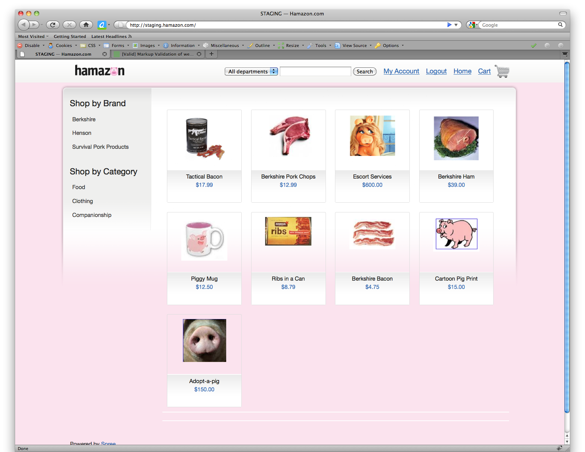
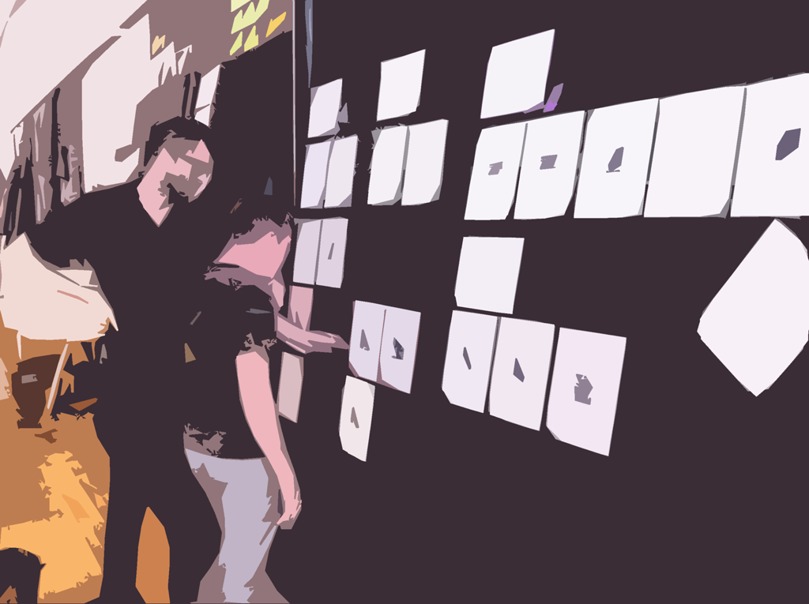
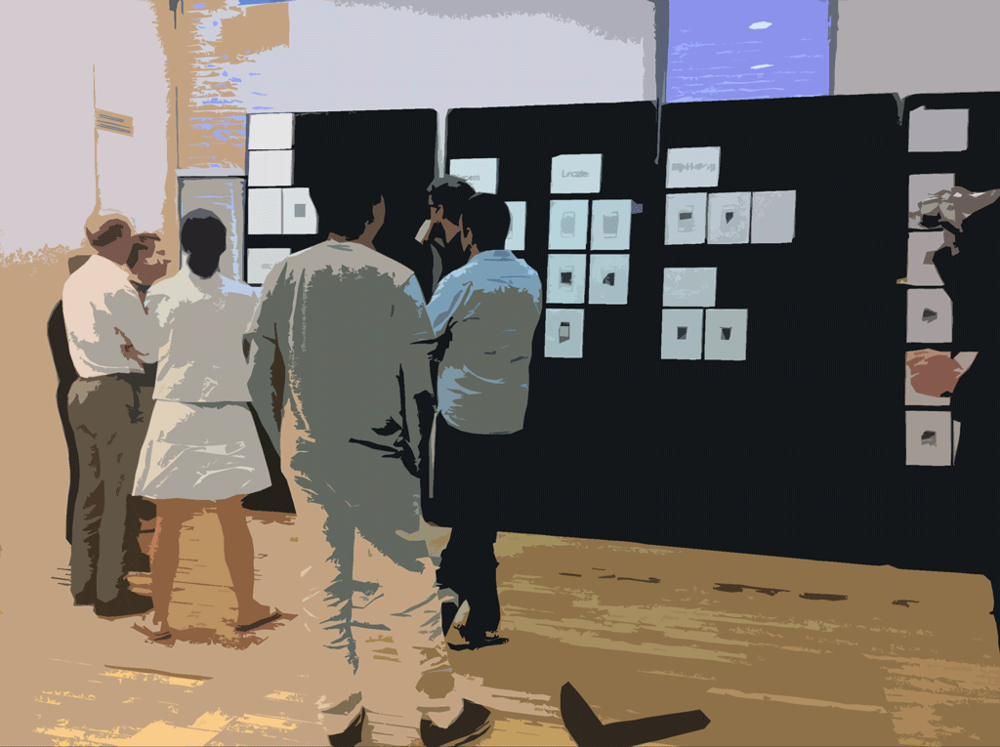
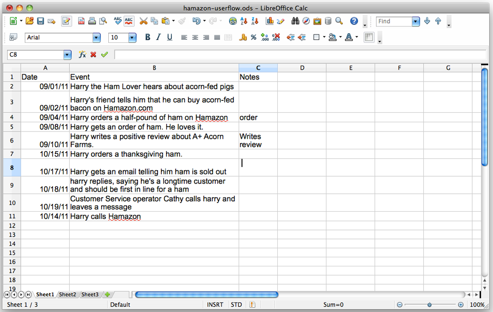
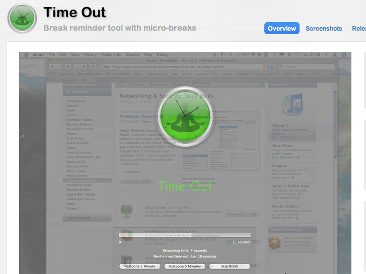
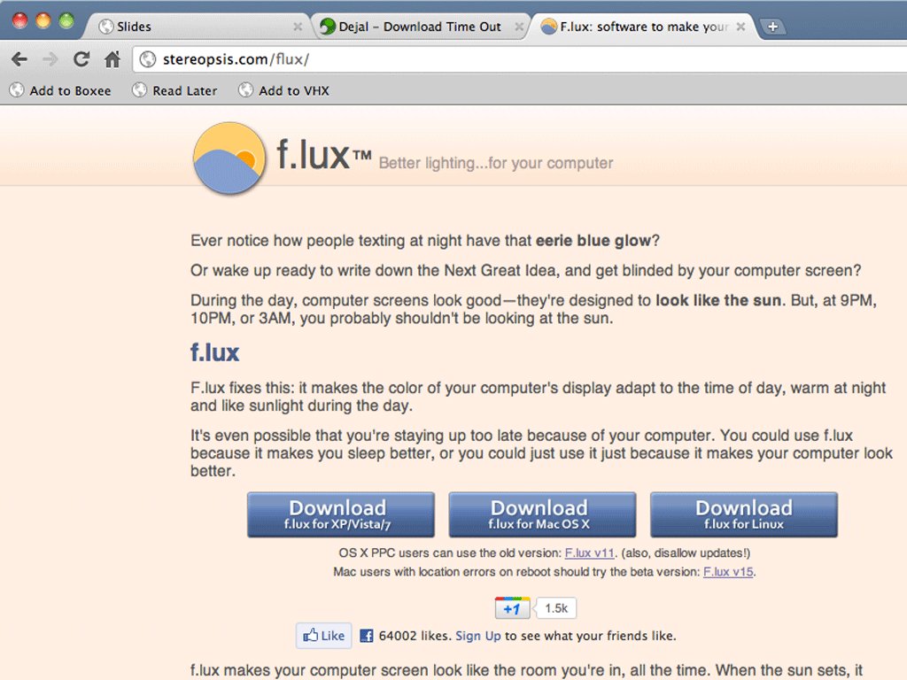

!SLIDE
# Hello

!SLIDE
# 7 Tips 

# for Practicing UX 

# in an Agile Environment

Jonathan Berger, Pivotal Labs, September 2011

!SLIDE
The plan:
# 45 minutes
(20 minute talk 
+ time for discussion)

!SLIDE
# What it says on the tin:
> Jonathan will lead a discussion about various strategies of integrating UX practice and Agile Development, talk about pacing and mock-up techniques, and share his experience with three years of Pivotal-Tracker-oriented Test-Driven Development at Pivotal Labs.

!SLIDE
Origin Story
# Why am I here?
> Why have I spent the last three years doing Pivotal-Tracker-oriented Test-Driven Development at Pivotal Labs?

!SLIDE
It started with 
# Spot.us

!SLIDE
I saw what the 
# Agile process did for Devs 
and I thought

!SLIDE
# Designers can haz?!

!SLIDE

!SLIDE
> I believe that design tasks have similar problems to those which that led to Agile development, and can benefit from similar techniques. 

> I'll test this hypothesis by sharing some tactics and listening to whether they resonate with this group.

!SLIDE
# Tips & Techniques & Tactics
& other 'T' words

!SLIDE
## Tip 1: Designers should 
# Talk at Stand up
- Makers are pigs too. Makers talk.
- Stand-ups should be rigorously high-orthodox.
- You can have more than 1 stand-up per day.

!SLIDE
## Tip 2: Use Ubiquitous language
# Label mock-ups and assets 
> Use the same terms for the same things

!SLIDE
## Tip 3: Pick a story
# and Stick with it 
> It's really effective to develop a default sample story and use it to mock or test or teach.

!SLIDE
# Stick to your story

!SLIDE
# Tip 4: Optimize Physical Spaces for Conversation
> Foamcore is awesome. Create spaces to create conversation. Externalize.

!SLIDE
# Mocks on Foamcore

!SLIDE
# Foamcore == Mobile walls!!

!SLIDE
## Tip 5: Humans are narrative creatures
# Design for Narrative
- Real and internally consistent test stories lead to better products.
- Bring your Personae and User Flows into tests.
- Make it easy for devs to use that research (post paper copies).

!SLIDE
## Tip 5: Personas are more memorable
# with alliterative names
- Frank the Farmer
- Bennie the Butcher
- Sam the Shopper

!SLIDE
# Post basic Userflow scripts as test data

!SLIDE
## Tip 5: At first
# Design in Adobe Creative Suite
- Before working software is built,
- for most IA and User Flows,
- for novel interactions 

!SLIDE
## Tip 5: Unless you can
# Design on a Whiteboard
- Because that's usually faster
- And faster's often better
- And whiteboards are conversationsal

!SLIDE
## Tip 5: I can't count
That '7 Tips' thing? 
**Total lie!**

!SLIDE
## Tip 9: Maintain
A sustainable pace.

!SLIDE
# Play

!SLIDE
# Rest

!SLIDE
# Remember you're a Mammal

!SLIDE
## Bonus Tip!

!SLIDE
## Tip 10: Then,
# Design in the Browser
> When working software exists
> and your mocks start falling out of sync

!SLIDE
## Use Firebug
# to manipulate the DOM
> and then take screenshots

!SLIDE
## which can be hacked up
> in your favorite raster editor

!SLIDE
# LIVE DEMO (time permitting)
Who's wants to deface something?

!SLIDE
## this technique lets you 
# move **FAST**

!SLIDE
## for bonus points
# Save the HTML
> and check it into version control
> to work on longer mocks and be able to save them

!SLIDE
# My Open Questions:
- What are your tips?

!SLIDE

!SLIDE
Find me at
## jonathanpberger@
pivotallabs.com, gmail.com, twitter, forrst, flickr, etc...

## Thanks!
# Questions?

